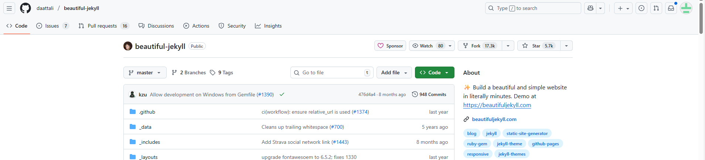
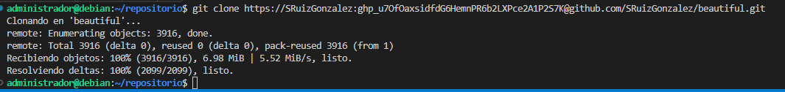
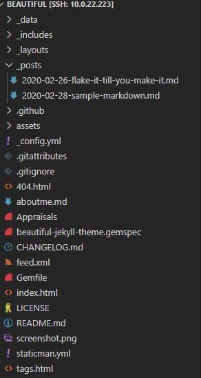
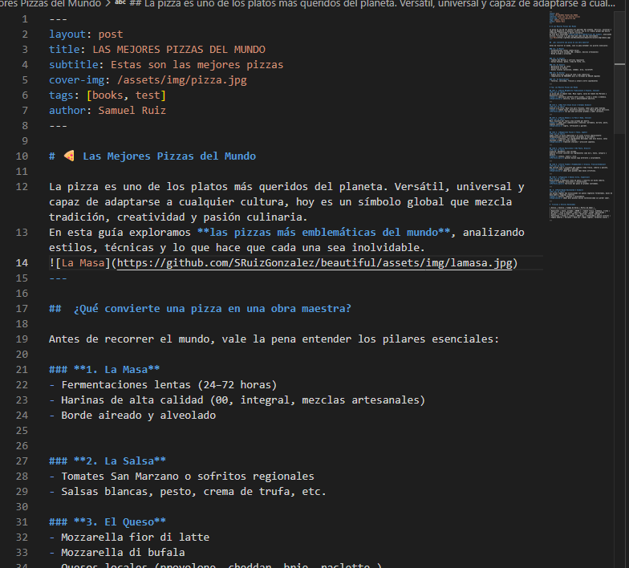
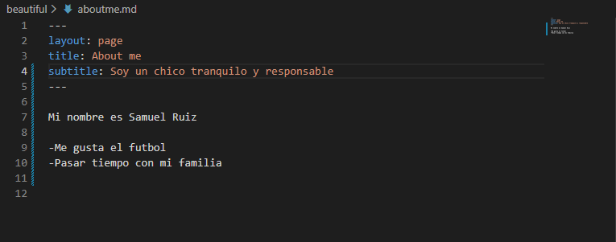
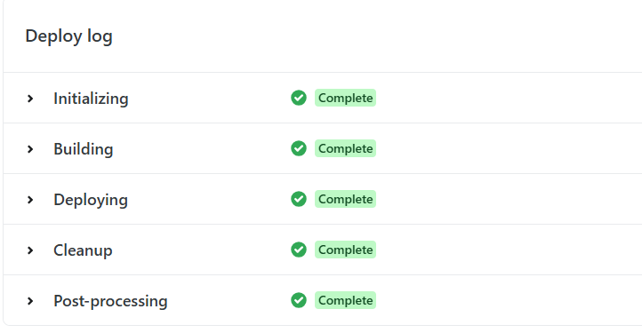

# EJERCICIO 3
## SAMUEL RUIZ

## PASO 1
1. Entramos en la web de jekyll themes y elegimos un tema que nos gste miraremos la demo

## PASO 2
2. Despues haremos un fork a nuestro usuario de **GitHub** 

## PASO 3
3. Y el siguiente paso sera hacer un `git clone` en el visual studio

## PASO 4
4. Ya tenemos todos los archivos del tema beautiful para editar.

## PASO 5
5. Empezamos a editar los posts a un tema que elegiremos nosotros.Este es el primer post.

## PASO 6
6. Este es el segundo post que vamos a editar.

## PASO 7
7. Ahora editaremos el about me.md y pondremos todo lo nuestro.

## PASO 8
8. El siguiente paso sera entrar en la web de netlify y añadir nuestra cuenta de **GitHub**

## PASO 9
9. Aqui ya vemos que estan todos nuestros repositorios en el netlify

## PASO 10
10. Ya esta todo el build echo aunque he tenido algunos problemas en hacerlo,para ello e tenifo que subir el **_site** a **GitHub** y luego cambiaremos el **_config.yml** poniendo la url de nuestra pagina de netlify.

## PASO 11
11. Veremos nuestro tema en netlify y funcionando correctamente.
