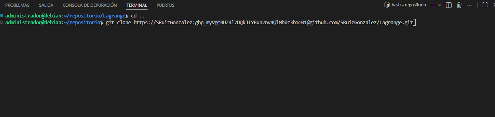
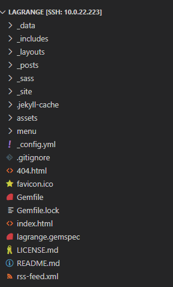
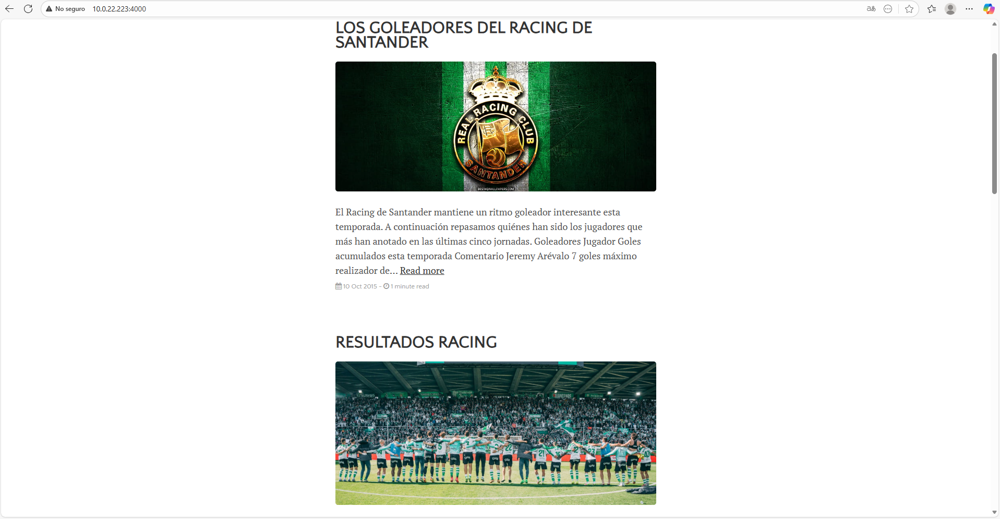
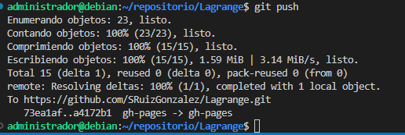

# EJERCICIO 2
## SAMUEL RUIZ

## PASO 1
1. He echo un fork del tema Lagrange usando el comando `git clone`

## PASO 2
2. Ya estamos dentro del Larange y tenemos todos sus archivos para editar

## PASO 3

3. Ahora tengo que configurar los posts que aparecen en el tema Larange

## PASO 4
4. Entrar en **GitHub Pages** y comprobar que se ha construido.

## PASO 5

1. Iremos a la web para comprobar que esta funcionando todo correctamente

## PASO 6
5. Ya he acababo la web lo siguiente

## PASO 7
6. Hacemos un `git push` para subir al **GitHub Pages**

